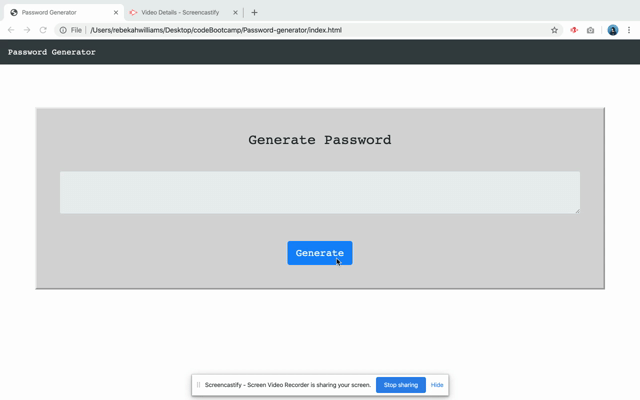

# JavaScript: Password Generator

An application that generates a random password based on user-selected criteria. This app runs in the browser and features dynamically updated HTML and CSS powered by your JavaScript code. It features a clean and polished user interface and is also responsive. 

## User Story
```
AS AN employee with access to sensitive data
I WANT to randomly generate a password that meets certain criteria
SO THAT I can create a strong password that provides greater security
```

## Application Operation
```
User clicks the "Generate" button and is presented with a prompt and a series of confirms: 
Prompt  - User selects a password length between 8 and 128 characters long. 
Confirms  - User then confirms whether special characters, capital letters, and lower case letters should be included in password. 
Once all confirms are answered, password is written into the display box according to the user's selected criteria. 
```

